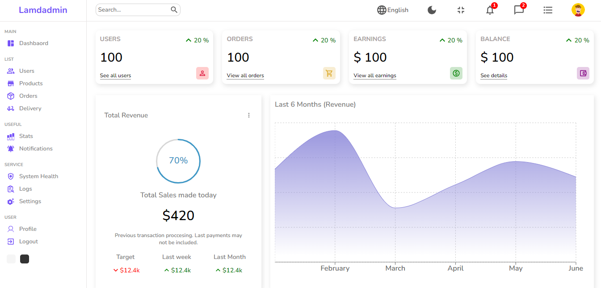

# React Material Dashboard

This Reactjs dashboard is built with Material Design, a modern and user-friendly design system from Google. It is fast, responsive, and easy to customize.

## Features

* Modern and user-friendly design
* Responsive and adaptive
* Easy to customize
* Built with Reactjs and Material Design
* Fast and performant

## Screenshots




## Installation

To install this dashboard, simply clone the repository and run the following command:

```bash
npm install


Once the dependencies have been installed, you can start the development server with the following command:

bash
npm start


The dashboard will be available at http://localhost:3000.

## Usage

To use the dashboard, simply open the application in a web browser and log in with the following credentials:

* Username: admin
* Password: password

Once you are logged in, you will be able to access all of the features of the dashboard.

## Customization

The dashboard is easy to customize. To change the theme of the dashboard, simply edit the `src/themes/default.js` file. To add new components or pages, simply create new files in the `src/components` and `src/pages` directories, respectively.

## Support

If you have any questions or problems with the dashboard, please feel free to open an issue on GitHub.

## License

This dashboard is licensed under the MIT License.


You can replace the screenshots with screenshots from your own images folder. To do this, simply copy the screenshots to the root directory of your project and update the README.md file to include the following links:

```markdown


